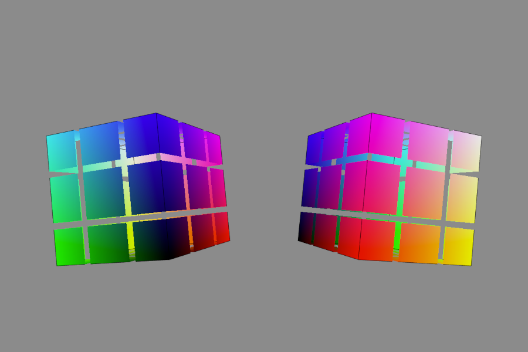
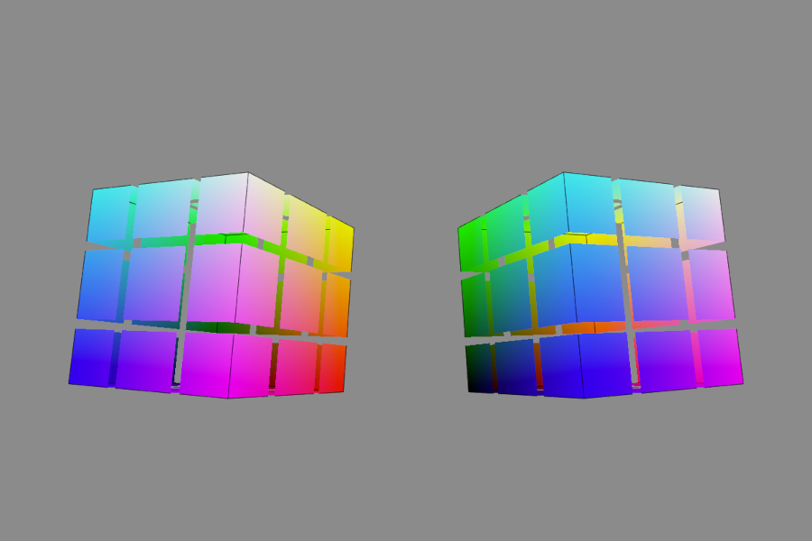
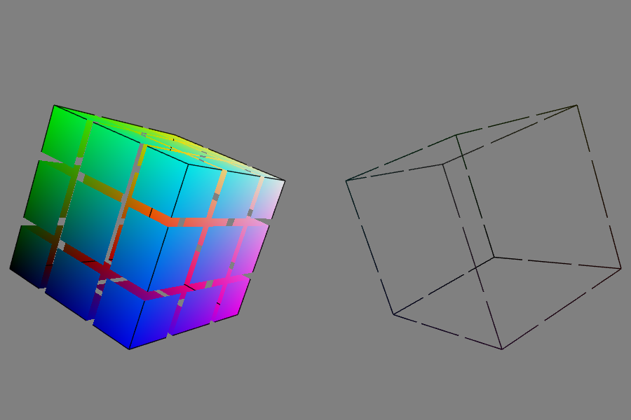
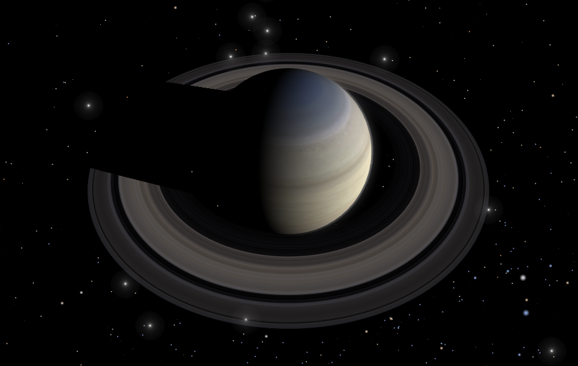
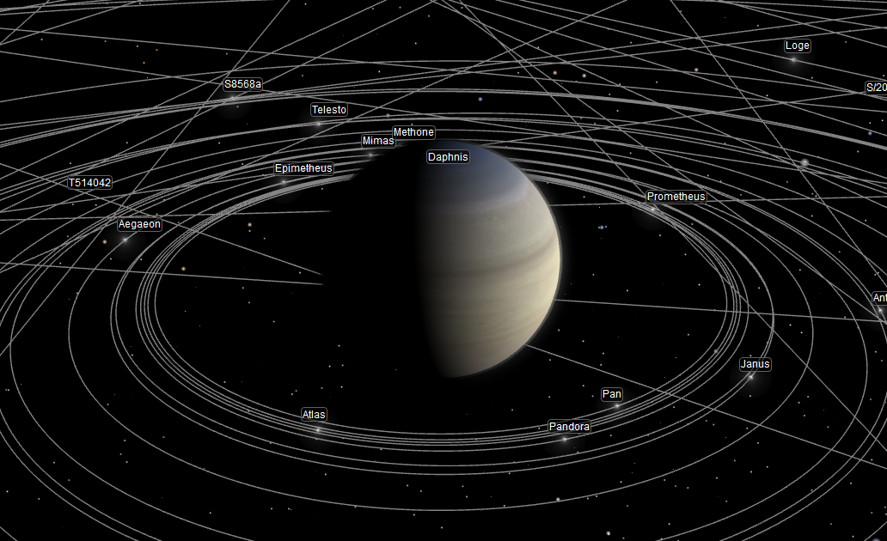

## Windows-specific WebGL Shader Crash


### Problem Outline

The following demo renders two rotating cubes using WebGL & GLSL shaders. But on Windows the right cube is not rendered properly.



* Tested on Ubuntu 20.04 using Firefox and Chromium.



* Tested on macOS 10.15 & 11 using Safari and Firefox.



* Tested on Windows 8.1 and 10 using Firefox and Edge.

JS console shows the following error log:

```
WebGL warning: linkProgram: Failed to link, leaving the following log:
C:\fakepath(68,28-54): internal error: invalid access of unbound variable

Warning: D3D shader compilation failed with default flags. (ps_5_0)
 Retrying with skip validation
C:\fakepath(68,28-54): internal error: invalid access of unbound variable

Warning: D3D shader compilation failed with skip validation flags. (ps_5_0)
 Retrying with skip optimization
C:\fakepath(68,28-54): internal error: invalid access of unbound variable

Warning: D3D shader compilation failed with skip optimization flags. (ps_5_0)

Failed to create D3D Shaders
```


### What is Different Between Cubes

The cubes use almost identical GLSL shaders. The only difference is order of multiplication in the fragment shader. Shader that is rendered properly on all systems calculates final fragment value in the following way:

```
// This works everywhere
gl_FragColor = shade() * color();
```

AT the same time shader that crashes on Windows has the two operands of the multiplication flipped:

```
// This crashes on Windows
gl_FragColor = color() * shade();
```


### History

This was [found as a bug](https://github.com/typpo/spacekit/issues/22) in the [spacekit](https://github.com/typpo/spacekit) library for space visualizations.

On Linux and macOS shader that renders Saturn's rings produces the following image:



On Windows however, there were no rings in the scene:



This bug was fixed in the library by a [commit that flipped multiplication operands](https://github.com/typpo/spacekit/commit/a4c81a38ac4faf2eb78a73595ead75d332351d1b).


### Problem Description

I've found out the similar error in the TensorFlow JS library (https://github.com/tensorflow/tfjs/issues/1337). It's not directly aplicable to this case, but the solution for that bug (https://github.com/tensorflow/tfjs-core/pull/1646) showed that there might be flaws hidden deep in a valid and working code because of the GPU drivers (like an inability to handle integer division correctly in TensorFlow case).

So I've checked the ring's frament shader for suspicious things. There is the following calculation of the pixel's colour:

```
  void main(void) {
	gl_FragColor = color() * vec4(lights() * shadow(), 1.0);
  }
```

The `color()` function contains `discard` option as the conditional path. 

```
  vec4 color() {
    ...
    if (...) {
      discard;
    }
    ...
  }
```

Commenting this out (or replacing with `return vec4(0.0)`) fixes the problem (and renders the scene wrong of course).

At the same time, there is a varible `c` initialisation in `shade()`:

```

vec4 shade() {
    float c = u_shade.r;
    return vec4(vec3(c), 1.);
}
```

My guess is that the driver on Windows cannot handle variable deallocation correctly. When an operand of the multiplication operation (`color()` function) calls `discard` it does not discard the multiplication operation as a whole. The second operand that is the result of `shade()` function is calculated anyway. Thus when the second operand `vec4(...)` is calculated it tries to multiply the result by the left operand that has already been discarded and the driver crashes (hence the vague 'unbound variable' text in the error log).

Important note is that the second operand `shade()` should have internal variable (`c`) to cause de-allocation error and crash the shader compilation.

Switching the operands of the final multiplication allows rings to be rendered:

```
	gl_FragColor = vec4(lights() * shadow(), 1.0) * color();
```


### Links

* [No rings in the visualization of the Saturn system](https://github.com/typpo/spacekit/issues/22) &ndash; several methods of drawing a line in WebGL.
